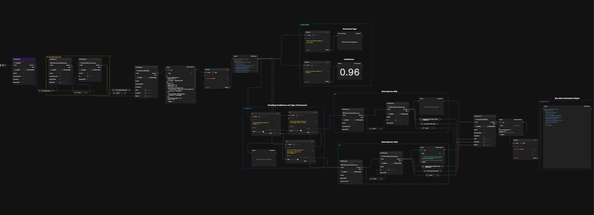

# Document Understanding AI model and API

This project involves creating a document understanding AI model using Oracle Cloud Infrastructure (OCI) to classify and extract data from two types of documents: Bill of Lading (BOL) and Statement of Account (SOA). The model leverages OCI's AI capabilities to accurately identify these document types and extract relevant information. To streamline and automate the process, API calls were implemented using Postman.


## Features

-  ```Document Classification ```: The AI model classifies documents into two categories: BOL and SOA.
-  ```Data Extraction ```:Extracts specific data fields based on the document type.
-  ``` Automation with Postman ```:API calls are used to automate the classification and data extraction processes.


## Technologies Used

- Oracle Cloud Infrastructure
- AI/ML for document understanding
- Postman for API automation

## ScreenShots
#### workflow.

#### Classification

#### Key-Value Extraction

